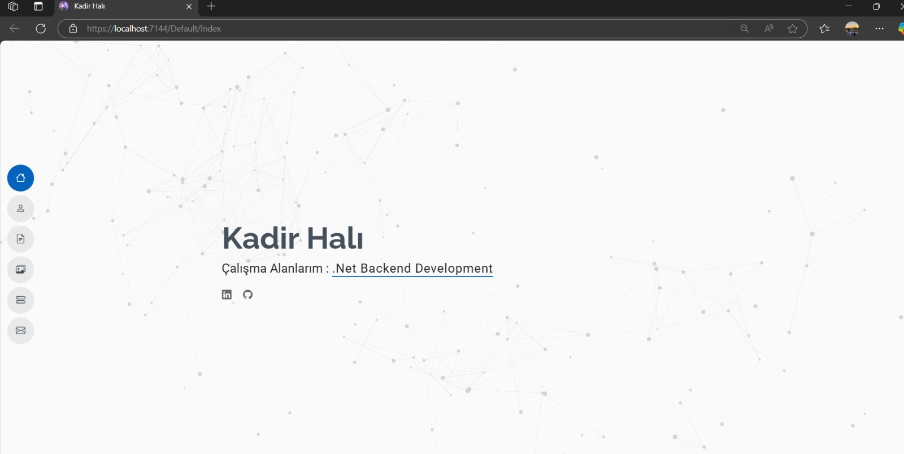
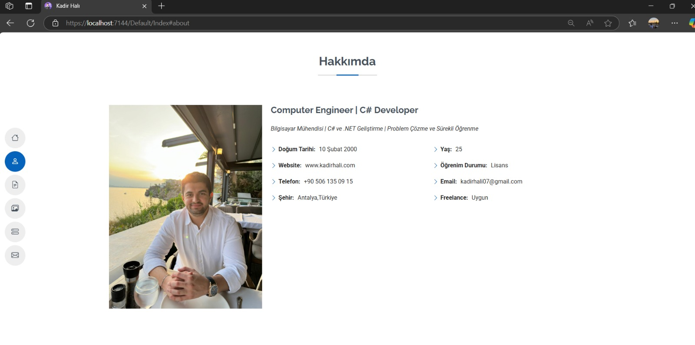
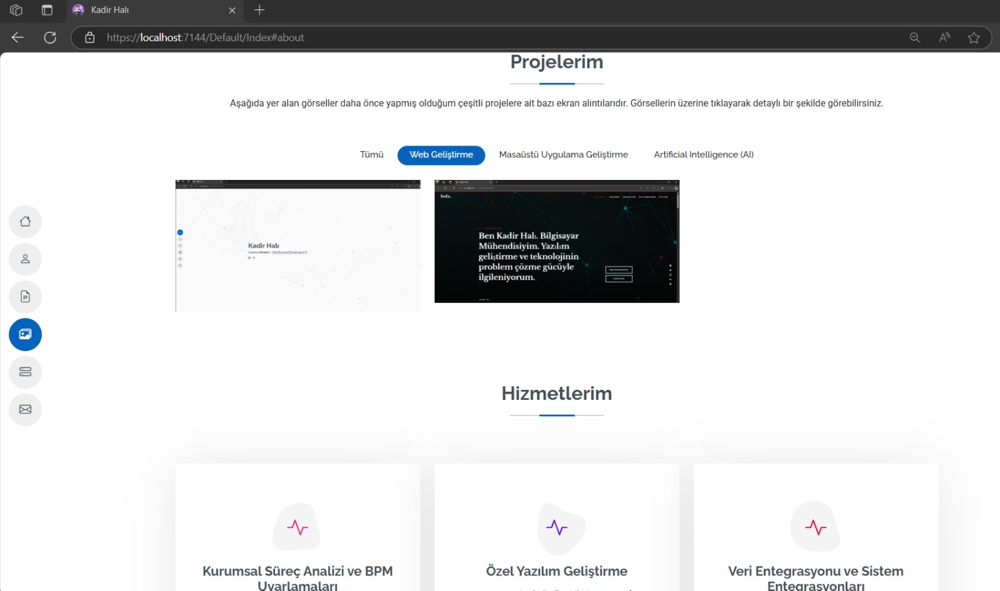
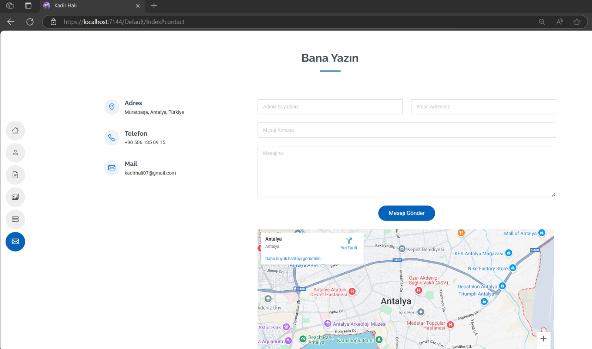
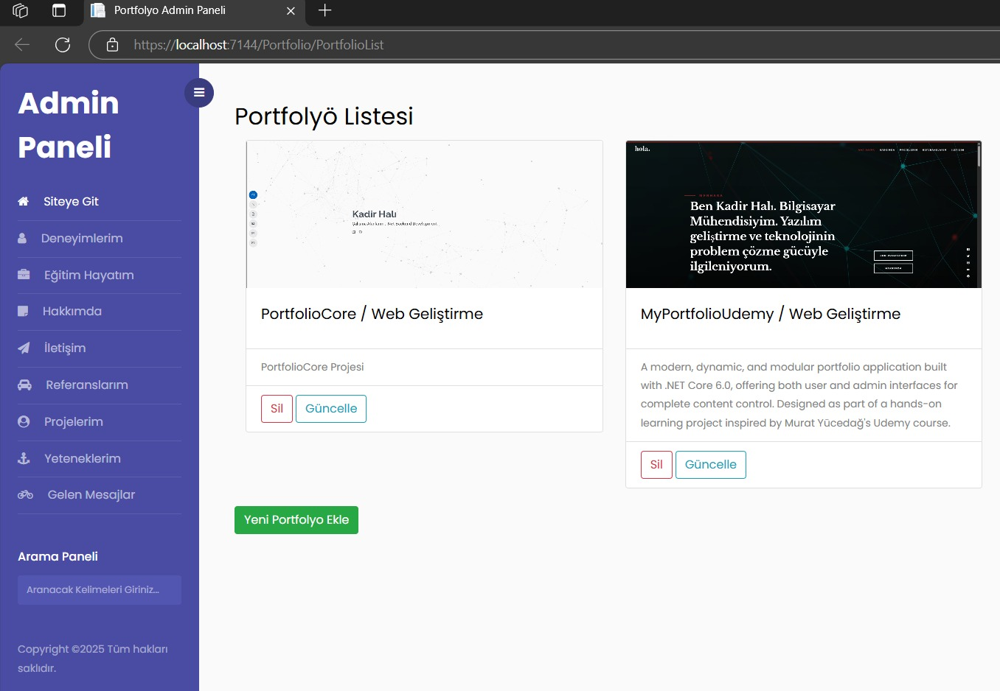
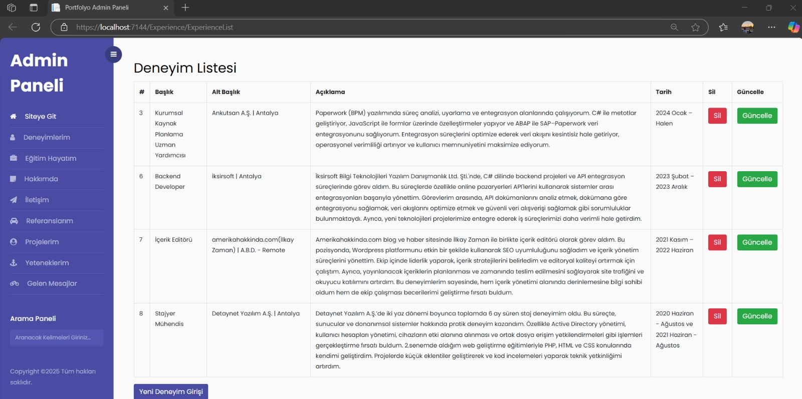
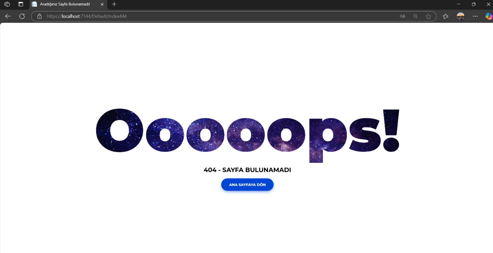
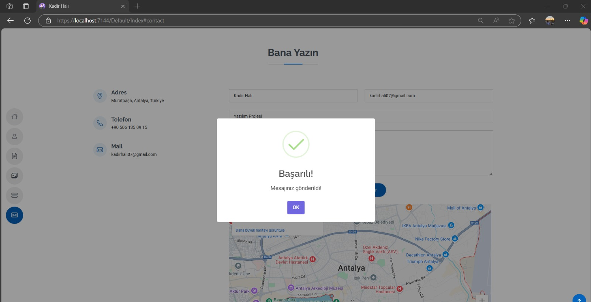

# 💼 Personal Portfolio Web Application – ASP.NET Core MVC

A modern and fully dynamic personal portfolio web application built with **ASP.NET Core MVC**. This project allows you to present your skills, experiences, projects, and services while managing incoming messages and application statistics from an intuitive and responsive admin panel.

## 🎯 Features

- 🔧 **Skill Management** – Add, update, delete skills.
- 💼 **Experience Management** – Track job and internship experiences.
- 🖼️ **Portfolio (Project) Management** – Share categorized projects dynamically.
- 📩 **Message Management** – View, delete, and track visitor messages.
  - Mark messages as **Read/Unread**.
  - SweetAlert pop-up on successful send.
- 📊 **Statistics Panel** – Display real-time stats like total projects, skills, messages, and random numbers (10–20).
- 📚 **Education Section** – Fully database-driven education timeline.
- 🧰 **Services Section** – Pull last 6 out of 8 services from the database.
- 🌐 **About & Contact Sections** – Dynamically loaded from the database, includes Google Maps Embed.
- ❌ **Custom 404 Page** – User-friendly error redirection.
- ⚙️ **Admin Panel** – Fully dynamic CRUD for all entities.
- 📱 **Responsive Design** – Built with Bootstrap 5 for all devices.
- 🎨 **Modern UI Components** – Clean and consistent interface.

---

## 📌 Use Cases (Development Cases Implemented)

1. Add social media links and icons dynamically via entity.
2. Workspace items fetched dynamically from the database.
3. About section entirely dynamic.
4. Stats panel includes:
   - Project Count
   - Reference Count
   - Skill Count
   - Random number (10–20)
5. Skills are database-driven.
6. Summary section removed.
7. Education timeline dynamic.
8. Projects fetched dynamically with category filtering.
9. Clickable category filter: Show relevant or all projects.
10. Services section fetches last 6 of 8 services.
11. References section dynamic.
12. Embedded Google Maps in Contact section.
13. Send message functionality works with database saving.
14. SweetAlert for success message after submission.
15. Fully dynamic admin panel (including CategoryList).
16. 10 statistics displayed on dashboard.
17. Projects displayed with visuals and card title.
18. Custom 404 error page included.
19. Message read/unread toggle with update button in Admin Panel.

---

## 🧱 Tech Stack

- **ASP.NET Core MVC**
- **Entity Framework Core**
- **MS SQL Server**
- **Bootstrap 5**
- **SweetAlert**

---

## 📷 Screenshots

| Home Page                         | About Section                     |
|-----------------------------------|-----------------------------------|
|          |          |

| Portfolio & Services Section      | Message Management                |
|-----------------------------------|-----------------------------------|
|          |          |

| Portfolio Dashboard               | Experience Dashboard              |
|-----------------------------------|-----------------------------------|
|          |          |

| Custom 404 Error Page             | SweetAlert                        |
|-----------------------------------|-----------------------------------|
|          |          |
